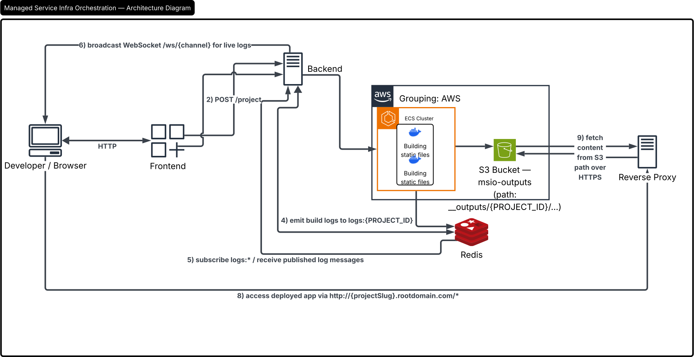

# Managed Service Infra Orchestration

Managed Service Infra Orchestration (MSIO) is a multi-service platform that builds frontend projects from Git repositories, uploads build artifacts to S3, and serves them through a reverse proxy.

## About

MSIO provides:
- **On-demand project builds** triggered through an API
- **Realtime build logs** via Redis Pub/Sub + WebSockets
- **Static artifact hosting** on S3
- **Wildcard subdomain routing** through a reverse proxy

## Repository Structure

- `frontend/` — React + Vite UI
- `apiServer/` — FastAPI service that queues build tasks and streams logs
- `buildServer/` — Builder worker that runs `npm install && npm run build` and uploads `dist/` to S3
- `reverseProxyServer/` — FastAPI reverse proxy for wildcard subdomain routing to S3 outputs
- `.github/workflows/aws.yml` — CI/CD workflow to build and deploy to AWS ECS

## Architecture




## Local Development

### Frontend

```bash
cd frontend
npm ci
npm run dev
```

### Frontend Production Build

```bash
cd frontend
npm ci
npm run build
```

### Python Services

Each Python service has its own `requirements.txt`:
- `apiServer/requirements.txt`
- `buildServer/requirements.txt`
- `reverseProxyServer/requirements.txt`

Install dependencies per service before running locally.

## Deployment

Deployment is handled by GitHub Actions (`.github/workflows/aws.yml`) on pushes to `master` for:
- `frontend/**`
- `apiServer/**`

The workflow:
1. Builds frontend assets
2. Copies build output into `apiServer/static`
3. Builds and pushes the webapp image to ECR
4. Updates ECS task definition and deploys to ECS service

